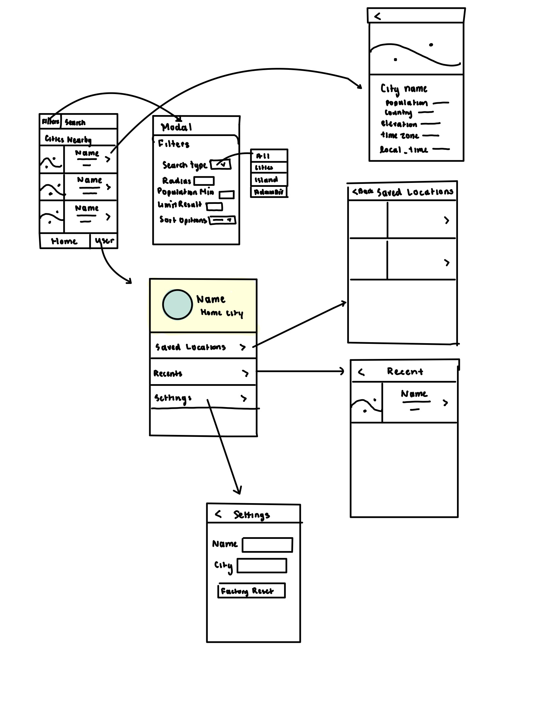

Original App Design Project - README Template
===

# City Explorer
- 

## 🎬🎬:VIDEO PREVIEW:🎬🎬
- https://youtu.be/b_TU2BDxsms

## Table of Contents

1. [Overview](#Overview)
2. [Product Spec](#Product-Spec)
3. [Wireframes](#Wireframes)
4. [Schema](#Schema)

## Overview

### Description

City Explorer allows users to get information about different cities around world.  Cities can be found in mutiple ways, 1) By default info is shown about the user's home-town.  Additionally CityExplorer can tap into the device's current location and return cities around them (50-mile radius).  Lastly users can search for for a city they are intrested in and Google-Places API will attempt to locate the cloest matching result.  Users can favorite locations they are interested in and the app will allow them to quickly retrieved them

### App Evaluation

[Evaluation of your app across the following attributes]
- **Category:** : Travel
- **Mobile:**: Reccomendations, location based, local strorage
- **Story:**: Would be a great way to discover new places for their next vacations, better understand the urban areas around them, and learn about different places across this planet
- **Market:**: Anyone, especially those who enjoy traveling
- **Habit:** : Informational, check when interested 
- **Scope:**: System can be built up in increments, build basic UI, add search functionality from API, implement user profile features, Add optional photo and other discovery features as time allows.

## Product Spec

### 1. User Stories (Required and Optional)

**Required Must-have Stories**

1) ✅Provide basic geographic information about a location
2) ✅Show an image representing this location
3) ✅Search functionality of different cities 
4) ✅Users can bookmark their favorite location
5) ✅Have a recent tab for recently viewed items

**Optional Nice-to-have Stories**

1) ✅Mutiple ways to find a city including implemntation of utilization of onboard GPS
3) ✅User can change their name and home city
4) ✅App logo and launch screen
5) ✅Reset Application to erase user data
6) ✅Added SFWebkit View Controller to integrate a wikipedia page for more information about a city directly within the app

### 2. Screen Archetypes

1) User login
	- Creates user profile
2) Home page
	- Discovery of cities nearby
	- Search bar
3) User Profile page
	- Access recent and saved location
4) City Information Page
	- Access data about a location
	- Access optional picture of location
5) <Modal> Settings Page
	- Allows users to edit settings and reset the application

### 3. Navigation

**Tab Navigation** (Tab to Screen)

1) Home
2) User Profile

**Modal Navigation** (PopUp)

1) Settings Page

**Flow Navigation** (Screen to Screen)

Welcome screen -> User enters their information -> Saved presets -> brings them to home screen
User clicks preview of a city on Home Screen -> Information is fetched and formatted for the requested location ->User views detailed information about a city <Optionally> User clicks the WikiID link to learn more about the location </Optionally>  <Optionally> User choses to save this page by clickling the star on the right hand side below the image -> Back button is pressed-> User returns to main home screen
User clicks CL Button -> Home screen refreshes with current location information -> User clicks preview of a city on Home Screen -> Information is fetched and formatted for the requested location -> User views detailed information about a city <Optionally> User clicks the WikiID link to learn more about the location </Optionally>  <Optionally> User choses to save this page by clickling the star on the right hand side below the image -> Back button is pressed-> User returns to main home screen
User clicks Search bar-> User types in a location -> Location is then processed through API and screen is refreshed with searched location information -> User clicks preview of a city on Home Screen -> Information is fetched and formatted for the requested location -> User views detailed information about a city <Optionally> User clicks the WikiID link to learn more about the location </Optionally>  <Optionally> User choses to save this page by clickling the star on the right hand side below the image -> Back button is pressed-> User returns to main home screen
User clicks user's tab -> User's profile tab is displayed with three opitions { Recently Viewed Cities, Saved Cities and Settings }
User Profile -> Recents Page -> The User's Recently Viewed Cities is Retrieved -> More detailed information about a recent search location they viewed is presented -> User clicks preview of a city on Home Screen -> Information is fetched and formatted for the requested location ->User views detailed information about a city -> User returns to main home screen
User Profile -> Recents Page -> The User's Recently Viewed Cities is Retrieved -> A list of all city they viewed recently is presented -> User clicks preview of a city the recently viewed -> Information is fetched and formatted for the requested location ->User views detailed information about a city <Optionally> User clicks the WikiID link to learn more about the location </Optionally>  <Optionally> User choses to save this page by clickling the star on the right hand side below the image -> Back button is pressed-> User returns to main home screen
User Profile -> Saved Page -> The User's saved cities is Retrieved -> A list of all city they saved is presented -> User clicks preview of a city they saved -> Information is fetched and formatted for the requested location ->User views detailed information about a city <Optionally> User clicks the WikiID link to learn more about the location </Optionally>  <Optionally> User choses to save this page by clickling the star on the right hand side below the image -> Back button is pressed-> User returns to main home screen
User clicks settings icon -> User's setting and information is loaded -> User changes a setting {Name or Home City} -> User clicks save -> User's updated settings are written to local storage -> Updated settings are reflected on user's user page (Search results from updated home city take place after reboot)
User clicks settings -> User clicks reset settings -> Local storage and user info is erased -> User to told to restart the app

## Windows Used 
1) Login
   - User info is first recorded and used throughout app
   - 
2) Stream
   - Home screen, recently viewed screen and saved cities screen
   - 
   - 
   - 
   - 
   - 
3) Detailed
   - City/location information is displayed in detailed.  links to references for more information User can bookmark this lcoation using the star icon
   - 
   - 
4) User Profile
   - User can see there name and hometown.  They can also access cities they bookmarked and viewed recently
   - 
5) Settings
   - User can edit there name and location, reset all information and data within the app
   - 
   - 

## Wireframes

### Models

[Add table of models]

### Networking

APIS in use
   - Rapid's GeoDB
   - Google Places Photo
   - Google Places Details
   - Google Places Autocomplete

     # FOR SECURITY API KEYS ARE NOT PROVIDED (Sign up for them yourselves )
     	- 
